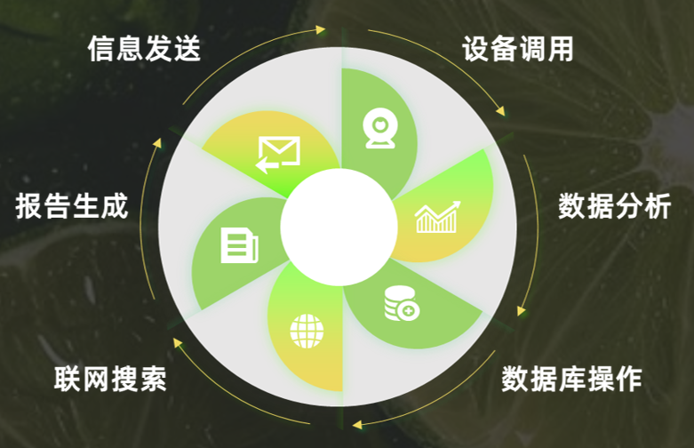
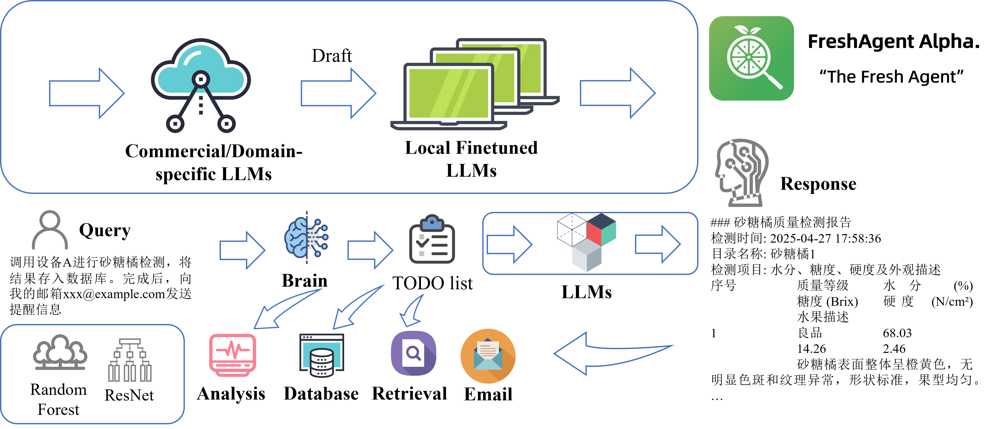
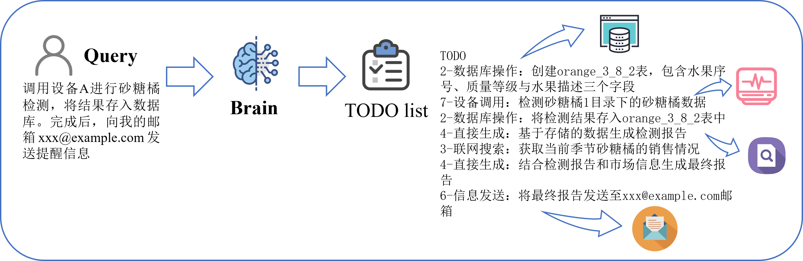
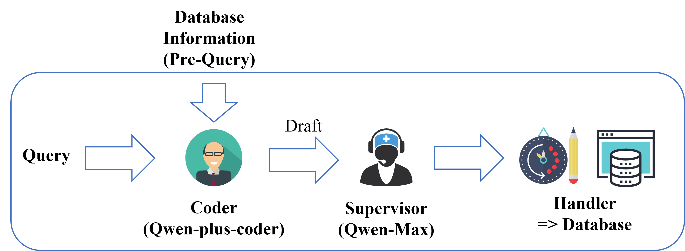

# 🥬 FreshAgent Alpha Ⅱ


## 🔥2025-07-14 更新


### 端到端（End-to-End）果蔬检测智能体，FreshAgent Alpha Ⅱ
经过近4个月的开发调试，FreshAgent 现已具备稳定的**根据任务执行结果智能规划任务序列**的能力
- **“工具调用”式端到端实现**：FreshAgent Alpha Ⅱ 基于 **工具调用（Function Calling）** 与 **动态任务调整** 提供果蔬检测任务的端到端服务
- **简化的任务逻辑**：FreshAgent Alpha Ⅱ 简化了任务规划部分的逻辑，效率预期提升`200%`，LLM Token 使用预期下降`20%`
- **新增“深度分析”功能**：FreshAgent Alpha Ⅱ 提供接入[天工开悟KwooLa](https://github.com/HIT-Kwoo/KwooLa)模型的接口，可以使用专业的农业大模型进行检测数据的深度分析
- 对代码库进行重构

## 🔥2025-07-13 更新
- 现在可以调用 [FastSAM](https://github.com/CASIA-IVA-Lab/FastSAM) 进行缺陷检测与缺陷面积比例计算
- FreshAgent Alpha 使用的 `YOLO-v8` Backbone 经过团队收集、筛选的高质量开源数据微调（基于[Ultralytics YOLO v8](https://huggingface.co/Ultralytics/YOLOv8)）；权重已公开至 `Modules/ImageModules/ImageProcess/model` 下
- 对代码库进行大幅重构

---

## 🍎 FreshAgent
**FreshAgent** 是 **电子科技大学旸谷青年科创中心“鲜”而易见团队**开发的一款**智慧农业**领域，执行**产业级批量果蔬检测**的智能体，旨在帮助不具备果蔬检测全栈能力（操作设备、录入数据、知识检索、报告汇总）的操作人员通过自然语言完成专业级的果蔬检测任务。

FreshAgent 填补了国内的 LLM-based 农业智能体空缺，是**国内首个聚焦果蔬检测的开源端到端智能体**。利用图像识别、光谱分析等技术进行果蔬新鲜度评估与分类，适用于零售、物流、食品安全等领域，帮助实现智能化的质量控制。

`FreshAgent Alpha` 是 FreshAgent 的基础模型，实现了基本的功能路由与函数调用。“鲜”而易见团队将模型向社区开源，力求以绵薄之力助力AI+农业发展。

在 `FreshAgent Alpha` 基础上，“鲜”而易见技术团队在基础的 `TODO List` 模式的上进行优化，实现了**端到端**的 `FreshAgent Alpha Ⅱ`.



### 👣 目录说明

- `data`: FreshAgent 可访问的 **输入数据**
- `knowledge`: FreshAgent 可访问的 **本地知识**
- `output`: FreshAgent 的 **输出路径**

---
## 📖 技术路线

FreshAgent 采用基于工具调用的 **动态任务规划** 与 **功能路由** 机制集成多个功能模块。用户输入被大脑模型（Brain）拆解为多个需求，并根据需求类型调用不同的模块进行处理，并在处理过程中，由大脑进行任务的动态规划。最终根据用户需求进行结果汇总。




### 🔬 Analyze

FreshAgent 对于 data 目录下的数据具有访问能力，支持对光谱/图像进行多模态分析。要使用 data 目录进行原生数据分析，需要：

1. 创建并进入对应数据目录，强烈建议以水果名命名，便于Brain识别
```commandline
mkdir ./data/apple
cd ./data/apple
```

2. 创建 img 与 spec 目录，分别存放图像数据与光谱数据
```commandline
mkdir ./img ./spec
```

3. 上传数据。FreshAgent按去除后缀的文件名进行数据匹配


### 🧠 Brain

用户输入进入 Brain 后，Brain 进行任务拆解。



### ❓ Query

数据库操作涉及到sql代码编写与执行。该部分对于Agent的能力至关重要。因此，FreshAgent Alpha对其进行了多项优化。

- FreshAgent Alpha 在提示词中注入数据库信息，保证模型对数据库具有实时了解
- FreshAgent Alpha 引入了 Supervisor (监管者模型)，对于代码的合法性进行检查
- 通过 Supervisor 检查的代码，才会被送入 `DatabaseHandler` 执行



### 🔍 Retrieve

FreshAgent Alpha 提供对本地知识库的原生支持。用户可以通过在 LocalDataBase 目录中上传 `pdf` 或 `txt` 文件，添加本地知识。打开 FreshAgent Alpha 的增强检索开关，会自动开启知识库检索。


---
## ⚙ 环境配置

1. 依赖安装
```commandline
  pip install \
  markdown \
  PyQt5 \
  apscheduler \
  zhipuai \
  openai \
  numpy \
  pandas \
  scikit-learn \
  scipy \
  joblib \
  matplotlib \
  langchain \
  pymysql \
  pdfminer.six \
  dashscope \
  pyserial \
```

2. 环境变量

以下环境变量在运行前需根据实际情况进行配置：

- `ZHIPU_API_KEY`：智谱清言 API 密钥
- `DASHSCOPE_API_KEY`：通义千问 API 密钥
- `KWOOLA_API_KEY`：天工开悟 API 密钥
- `DEEPSEEK_API_KEY`：DeepSeek API 密钥
- `DB_HOST`、`DB_USER`、`DB_PASSWORD`、`DB_NAME`、`DB_PORT`、`DB_CHARSET`：数据库连接信息
- `EMAIL_HOST`、`EMAIL_PORT`、`EMAIL_USERNAME`、`EMAIL_PASSWORD`、`EMAIL_USE_SSL`：邮件服务配置
- `AGENT_LOCATION`：报告中使用的地理位置

可在终端通过 `export` 或在 `.env` 文件中设置上述变量。


---
## 🚀 快速开始

### 🌏 环境准备

1. 克隆仓库

```bash
git clone https://github.com/yourusername/FreshAgent-Alpha.git
cd FreshAgent-Alpha
```

2. 配置环境

3. 运行可视化页面（基于PyQt5开发）
```bash
python GUI.py
```

或直接在终端与FreshAgent进行对话

```bash
python FreshAgent.py
```

### 🏃‍ 运行接口

启动服务：

```bash
python api_server.py
```

接口示例：

```bash
# 提交文本任务
curl -X POST http://127.0.0.1:8000/api/chat \
     -H "Content-Type: application/json" \
     -d '{"user_input": "数据库中的砂糖桔呈现出什么特征？", "enhanced": false}'

# 上传图片
curl -X POST http://127.0.0.1:8000/api/image \
     -F image=@/path/to/img.jpg \
     -F prompt="请分析" \
     -F enhanced=true
```
---

## 📄 LICENSE

本项目采用 [MIT许可证](LICENSE) 开源

---

## 📬 联系方式

欢迎您的贡献！

- **“鲜”而易见团队负责人**：      杨长 [@Chang Yang](https://github.com/Andrew0450)
- **FreshAgent Alpha 开发总监**：王云溪 [@CyanCQC](https://github.com/CyanCQC)
- **邮箱**：                     FreshNIR@163.com

---

## 🙏 致谢

- [电子科技大学](https://www.uestc.edu.cn/) 为项目提供支持
- [旸谷青年科创中心]() 为项目孵化提供平台
- [天工开悟 KwooLa](https://github.com/HIT-Kwoo/KwooLa) 高性能农业大模型
- [FastSAM](https://github.com/CASIA-IVA-Lab/FastSAM) 高效、可边缘设备部署的实例分割技术